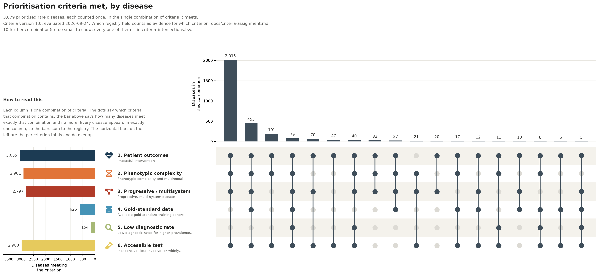
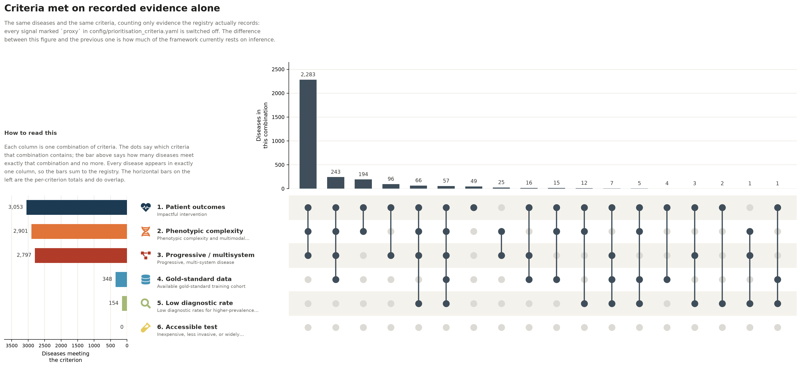

# How registry fields map to the six prioritisation criteria

<!-- GENERATED by `just build-criteria`. Edit `config/prioritisation_criteria.yaml`, not this file. -->

- Criteria version `1.0`, rendered 2026-09-25
- Source of the criteria: Which Rare Diseases Are Best Suited to Diagnostic AI? Towards a Systematic Selection Framework (2026 manuscript draft), Table 1 and the workflow figure.
- Evaluated over `prioritised-rare-disease-list.yml` &mdash; 3,079 diseases

## Why this document exists

The manuscript presents six prioritisation criteria. The registry (`prioritised-rare-disease-list.yml`) was not built around those six: it grew field by field, and carries a mixture of curated judgement calls (`justification_summary`, `misdiagnosis_bias`), derived structure (`value_sets`, `hpo_high_level_categories`) and imported annotation (`ontology_terminology_codes`, `curated_hpo_profiles`). This file states, explicitly and in one place, which of those registry fields is taken as evidence for which criterion.

## How to read the tables

Each criterion owns a set of *signals*. A signal is one rule over one registry field, and is either `direct` -- the field was recorded in order to say this thing -- or `proxy` -- the field says something adjacent and we are reading across a gap. `satisfied_when` is a boolean expression over the signal ids of that criterion, so a criterion is free to require a conjunction rather than just any-of.

## Read these caveats before the tables

Three things a reviewer should push back on first. (1) Criterion 6 (accessible test) has no direct support anywhere in the registry; every signal under it is a proxy and the resulting set is close to saturated, so it carries almost no discriminating information. The proxies are also this registry's own invention: the manuscript's Methods describe six evidence streams and test accessibility is not one of them, so nothing in the paper sanctions reading "is genetic" or "has an OMIM entry" as evidence that an inexpensive test exists. At 96.8% met and 0% on recorded evidence the criterion currently separates almost nothing, and what little it separates tracks OMIM coverage rather than anything about tests. (2) The curated label "Insufficient ICD coding/underdiagnosis" conflates two different criteria -- the absence of an ICD code is the *negation* of criterion 4b, while underdiagnosis is criterion 5 -- and it is assigned here to criterion 5 alone. (3) `justification_summary` is close to binary in practice: 2,404 of 3,079 diseases carry all five labels and 593 carry exactly two, so criteria that lean on it inherit that bimodality rather than adding to it.

## Summary

| # | Criterion | Evidence | Diseases | % | On recorded evidence only |
|---|-----------|----------|---------:|--:|-------------------------:|
| 1 | Patient outcomes | curated | 3,055 | 99.2% | 3,053 (99.2%) |
| 2 | Phenotypic complexity | mixed | 2,901 | 94.2% | 2,901 (94.2%) |
| 3 | Progressive / multisystem | derived | 2,797 | 90.8% | 2,797 (90.8%) |
| 4 | Gold-standard data | mixed | 625 | 20.3% | 348 (11.3%) |
| 5 | Low diagnostic rate | curated | 154 | 5.0% | 154 (5.0%) |
| 6 | Accessible test | proxy only | 2,980 | 96.8% | 0 (0.0%) |

The last column re-runs each criterion with every `proxy` signal switched off, i.e. counting only what the registry actually records. The gap between the two columns is how much of each criterion is inference.

## 1. Patient outcomes

*Impactful intervention*

The paper counts the negative consequences of not having a correct diagnosis, and the change in care management a correct diagnosis brings, among its most important criteria. 2a: patients face prolonged diagnostic odysseys, and earlier detection through aggregated real-world data can improve outcomes. 2b: the condition is actionable, meaning a diagnosis leads to prescribing a treatment, assessing a cancer risk, referring to a specialist or referring to a trial. Actionability is scoped deliberately. The personal utility of completing the diagnostic odyssey is acknowledged, but what is prioritised is a direct change in medical management that better patient identification would make possible.

**How it was curated.** Actionability was judged against the ACMG secondary-findings reporting guidance and against conditions rated strong or definitive by the ClinGen Actionability working group, together with the availability of treatment; clinical trials were in some cases identified manually in ClinicalTrials.gov, with systematic evaluation still to come. Treatment availability came from MeDIC, a foundational resource covering diseases, drugs, indications and contraindications, enhanced with additional provenance for this analysis. Diagnostic-delay impact relied on manual literature review and the team's clinical experience, and conditions whose guidelines support the importance of early management were likewise prioritised.

**Satisfied when:** `diagnostic_delay_flagged or intervention_flagged or approved_indication or high_work_impairment or high_care_impairment`

**Result:** 3,055 of 3,079 diseases (99.2%); 3,053 (99.2%) on recorded evidence alone, with proxy signals switched off. Evidence status: *curated* &mdash; recorded directly by curators for this purpose.

| Signal | Sub | Tier | Registry field | Fires on | What it means |
|--------|-----|------|----------------|---------:|---------------|
| Diagnostic delay impact | 1a | direct | `justification_summary` | 3,052 | Curators recorded "Diagnostic delay impact" in `justification_summary`. |
| Intervention potential | 1b | direct | `justification_summary` | 2,459 | Curators recorded "Intervention potential" in `justification_summary`. |
| Approved drug indication | 1b | direct | `indications` | 232 | MeDIC contributes at least one approved indication, so a diagnosis leads to a prescribable treatment. |
| Substantial work impairment | 1a | proxy | `work_capacity.impairment` | 86 | The frailty curation rates work capacity as SUBSTANTIAL or TOTAL. Severity is not the same as delay-sensitivity, but a disease that ends working life is one where a late diagnosis costs more. |
| Substantial care dependence | 1a | proxy | `care_dependence.impairment` | 86 | The frailty curation rates care dependence as SUBSTANTIAL or TOTAL. |

> **Coverage.** Both halves are curated directly, but "Diagnostic delay impact" is asserted for 3,052 of 3,079 diseases, so this criterion is effectively true by construction and discriminates almost nothing. The approved-indication signal is the only part of it grounded in external evidence.

## 2. Phenotypic complexity

*Phenotypic complexity and multimodal detectability*

Last, and framed by what the dataset is for. Because a significant expected downstream use of the combined dataset is as training data for AI models, the team considered whether a condition manifests identifiable signatures across multimodal data amenable to clinical applications and prospective model development. The requirement is that phenotype signatures already exist with established genomic, imaging and/or lab-based features, so that AI models working in the context of general care are realizable.

**How it was curated.** Judged by the clinical team from curated phenotype profiles. Disease phenotype profiles were available for roughly 8,000 rare diseases and are shown per disease as the curated HPO profile. Coverage is a known limit: HPO Annotation profiles exist for only about half of Mondo's rare disease classes, and many rest on small cohorts in the medical literature and are subject to ascertainment bias.

**Satisfied when:** `phenotypic_complexity_flagged or multimodal_flagged or deep_phenotype_profile`

**Result:** 2,901 of 3,079 diseases (94.2%); 2,901 (94.2%) on recorded evidence alone, with proxy signals switched off. Evidence status: *mixed* &mdash; part curated or derived, part inferred.

| Signal | Sub | Tier | Registry field | Fires on | What it means |
|--------|-----|------|----------------|---------:|---------------|
| Phenotypic complexity | &mdash; | direct | `justification_summary` | 2,458 | Curators recorded "Phenotypic complexity" in `justification_summary`. |
| Multi-modal detectability | &mdash; | direct | `justification_summary` | 2,459 | Curators recorded "Multi-modal detectability" in `justification_summary`. |
| Ten or more curated phenotypes | &mdash; | derived | `curated_hpo_profiles` | 2,171 | The curated HPO profile carries at least 10 terms, i.e. there is enough annotated detail to form a signature rather than a single hallmark. |

> **Coverage.** The two curated labels are near-duplicates of each other -- 2,458 diseases carry "Phenotypic complexity" and 2,459 carry "Multi-modal detectability", almost entirely the same diseases -- so they are kept as separate signals but contribute one criterion. Depth of the curated HPO profile is added as a derived signal; it is the only part not reducible to the curators' bulk labelling.

## 3. Progressive / multisystem

*Progressive, multi-system disease*

The third criterion, and the paper gives three reasons for it. Breadth and depth of phenotype make a diagnostic signal more likely to be recognised in real-world care data, in contrast to the numerous rare diseases with a few common manifestations where no diagnostic AI model is needed: intellectual disability in a paediatric setting already warrants a genomic test. Second, multi-system disease is what primary care and single-specialty care most often miss, which is exactly the context in which model output could provide clinical decision support. Third, multiple manifestations may be targetable by different treatments, relieving some negative outcomes even if only for a subset of signs and symptoms.

**How it was curated.** Computed rather than judged. Information content was calculated for HPO terms with the oaklib semantic framework over the HPO Annotations corpus, IC being the negative log2 of the probability of observing a term or any of its descendants, so rarer and more specific terms score higher. Each phenotype annotation was assigned to one or more of the 20 HPO organ-system branches through the ontology closure over subClassOf and part-of, so one term may count toward several systems. For each disease and system the mean IC of its annotations in that system was taken, and the breadth score is the sum of those means across affected systems: diseases touching more systems score higher, and systems annotated with more specific terms weigh more. The breadth metric was then combined with the presence of a known treatment to produce the HPO profile and treatment-based rank.

**Satisfied when:** `multisystem_phenotype or progressive_keyword or syndromic_keyword or syndromic_mondo_class`

**Result:** 2,797 of 3,079 diseases (90.8%); 2,797 (90.8%) on recorded evidence alone, with proxy signals switched off. Evidence status: *derived* &mdash; computed from structured registry data.

| Signal | Sub | Tier | Registry field | Fires on | What it means |
|--------|-----|------|----------------|---------:|---------------|
| Five or more HPO organ systems | &mdash; | derived | `hpo_high_level_categories` | 2,386 | `hpo_high_level_categories` names at least 5 of the 20 HPO organ-system branches. |
| Progressive | &mdash; | direct | `keywords` | 857 | Curators tagged the disease "Progressive". |
| Syndromic (keyword) | &mdash; | direct | `keywords` | 825 | Curators tagged the disease "Syndromic". |
| Syndromic (Mondo classification) | &mdash; | derived | `mondo_category_body_system` | 786 | Mondo classifies the disease under `syndromic disease`. |

> **Coverage.** This is the one criterion computed rather than asserted. The manuscript's own breadth metric (summed mean information content across the 20 HPO organ- system branches) is not stored per disease; the registry keeps only the list of branches touched, so the count of branches is used, with the cut at 5 of 20. That threshold is a judgement call and is the single most reviewable number in this file -- raising it to 7 or lowering it to 3 moves several hundred diseases.

## 4. Gold-standard data

*Available gold-standard training cohort*

The paper's first criterion for inclusion: is there a cohort of confirmed cases to develop and validate against? Registry-enrolled and specialty-clinic patients serve as phenotypic anchors, enabling computable phenotype development and validation that cannot be achieved from coded EHR data alone, where rare disease coding coverage remains critically incomplete (1a). A registry or clinic inside the collaborative also makes raw data collection feasible through existing resources and makes productive engagement with active research and patient communities likely. Failing that, a specific ICD-10-CM code lets a health-system cohort be assembled from coded records instead (1b).

**How it was curated.** Registries and specialty clinics were assessed through locus-specific databases, publicly available registries (Global Genes, NORD, RDCRN, CZI, MATRIX) and partner engagement, which quantified the individuals enrolled in shareable registries. Where coding allowed, de-identified EHR queries counted unique patients seen in the past five years by ICD-10-CM or SNOMED CT code, expanding across partner sites as candidate cohorts emerged. Where coding did not allow it, recruitment potential was estimated as 0.2 x total patient population x published prevalence. ICD-10-CM coverage was estimated computationally, comparing Mondo labels and exact synonyms against ICD-10-CM and ICD-11 Foundation codes by BioLORD-2023-C cosine similarity.

**Satisfied when:** `icd10cm_exact_value_set or icd10cm_xref or nord_listed`

**Result:** 625 of 3,079 diseases (20.3%); 348 (11.3%) on recorded evidence alone, with proxy signals switched off. Evidence status: *mixed* &mdash; part curated or derived, part inferred.

| Signal | Sub | Tier | Registry field | Fires on | What it means |
|--------|-----|------|----------------|---------:|---------------|
| Exact ICD-10-CM value set | 4b | direct | `value_sets.exact (ICD10CM)` | 254 | The derived value set carries at least one `exact` ICD-10-CM code, i.e. Mondo asserts a skos:exactMatch to a billable code. |
| ICD-10-CM cross-reference | 4b | direct | `ontology_terminology_codes` | 334 | Mondo carries an ICD10CM cross-reference for the disease. |
| NORD listing (registry proxy) | 4a | proxy | `ontology_terminology_codes` | 418 | A NORD cross-reference exists. Stands in for "a patient organisation or registry plausibly exists"; it is not evidence of a cohort we can reach. |

> **Coverage.** 1b is well supported -- the value-set build derives exact ICD-10-CM matches from Mondo, and Mondo's own xrefs carry ICD-10-CM codes. 1a is not represented at all: no registry, clinic or cohort field exists in the registry. A NORD listing is used as a weak stand-in because NORD runs the IAMRARE registry programme and a NORD entry at least implies an organised patient community, but it is an inference and should be replaced by real partner-network cohort data before this criterion is reported on.

## 5. Low diagnostic rate

*Low diagnostic rates for higher-prevalence rare diseases*

Second in the team's own ordering: conditions where low diagnostic rates coincide with a prevalence the experts judged relatively high. The argument is one of reach. A higher number of undiagnosed patients means a bigger impact in patient numbers, and real potential for improved recognition through computational phenotyping.

**How it was curated.** Prevalence came from the literature and from targeted counts of patients at planned recruitment sites, de-identified under the Expert Determination methodology. The probability of escaping detection under current standards of care could not be assessed in an automated fashion, because consistent data on both expected prevalence and diagnostic rates is lacking; manual literature review and expert experience of delayed diagnosis stood in as the proxy. Only 140 of the 3,079 selected diseases could be placed with confidence in the solicitation's higher-prevalence band of roughly 10-50 per 100,000.

**Satisfied when:** `underdiagnosis_flagged and (higher_prevalence or misdiagnosis_bias_recorded)`

**Result:** 154 of 3,079 diseases (5.0%); 154 (5.0%) on recorded evidence alone, with proxy signals switched off. Evidence status: *curated* &mdash; recorded directly by curators for this purpose.

| Signal | Sub | Tier | Registry field | Fires on | What it means |
|--------|-----|------|----------------|---------:|---------------|
| Underdiagnosis flagged | &mdash; | direct | `justification_summary` | 3,067 | Curators recorded "Insufficient ICD coding/underdiagnosis". Note the conflation -- the ICD-coding half of this label belongs to criterion 4b. |
| Higher-prevalence band | &mdash; | direct | `prevalence_category` | 153 | `prevalence_category` is H, H* or H-uncertain, i.e. the RAPID solicitation's ~10-50/100k band rather than the lower band. |
| Misdiagnosis bias recorded | &mdash; | direct | `misdiagnosis_bias` | 20 | A demographic or presentation bias driving mis- or under-diagnosis was written down for this disease. |

> **Coverage.** Unlike the other criteria this one is a conjunction, and deliberately so. The underdiagnosis label alone is asserted for 3,067 of 3,079 diseases and is therefore worthless on its own; the criterion as written in Table 1 is "low diagnostic rates *for higher prevalence RDs*", so the prevalence half is required. That makes this the most selective of the six, which matches the manuscript's own finding that only 140 diseases could be confidently placed in the higher-prevalence band.

## 6. Accessible test

*Inexpensive, less invasive, or widely available test*

A computational flag is only useful if the suspected diagnosis can then be confirmed. The paper prioritises conditions for which a readily available diagnostic test exists, its worked example being hypophosphatasia, where a history of fractures together with persistently low alkaline phosphatase points towards the diagnosis. The criterion carries a second purpose beyond feasibility: improving utilisation of the medically appropriate test.

**How it was curated.** Expert judgement, condition by condition. The paper's Methods name six evidence streams -- ICD code coverage, disease prevalence, underdiagnosis risk, treatments, phenotypic breadth, and registries and specialty clinics -- and test accessibility is not one of them. Every other criterion maps onto a described method; this one has none. What the paper gives instead is Table 1: the criterion's rationale plus six worked exemplars, each a clinician's judgement with a citation (alpha-1 antitrypsin serum levels, Wilson ceruloplasmin and urinary copper, targeted NGS panels for monogenic dyslipidemias, hypophosphatasia alkaline phosphatase, the Fanconi DEB breakage test, Diamond-Blackfan eADA activity). The four proxies below are therefore this registry's own construction, not a method the paper prescribes.

**Satisfied when:** `molecular_basis or omim_entry or biochemical_signature or haematological_signature`

**Result:** 2,980 of 3,079 diseases (96.8%); 0 (0.0%) on recorded evidence alone, with proxy signals switched off. Evidence status: *proxy only* &mdash; no supporting field exists; every signal is an inference.

| Signal | Sub | Tier | Registry field | Fires on | What it means |
|--------|-----|------|----------------|---------:|---------------|
| Known genetic basis | &mdash; | proxy | `mondo_category_genetic` | 2,763 | Mondo places the disease under a genetic-mechanism category, so a targeted sequencing panel is presumptively available. |
| OMIM entry | &mdash; | proxy | `ontology_terminology_codes` | 2,590 | An OMIM cross-reference exists, implying a defined molecular entry. |
| Metabolic involvement | &mdash; | proxy | `histopheno_categories` | 1,550 | Phenotypes fall under metabolism/homeostasis, so a biochemical blood assay is a plausible confirmatory route. |
| Haematological involvement | &mdash; | proxy | `histopheno_categories` | 1,623 | Phenotypes fall under blood, so routine blood work is a plausible route. |

> **Coverage.** Nothing in the registry records diagnostic-test availability, cost or invasiveness. Every signal here infers it from disease class: a Mendelian disease presumptively has a sequencing panel, a metabolic or haematological disease presumptively has a blood assay. The result covers roughly nine in ten diseases and should be read as "no evidence against" rather than as evidence for. The mismatch is one of granularity: the paper names a specific test per disease, while these signals ask only whether a disease is genetic, has an OMIM entry, or touches metabolism or blood. The last two loosely echo the paper's exemplars; "has an OMIM entry" as evidence of an inexpensive, widely available test is a stretch, and it is what drives the saturation, since nearly every Mendelian disease has one. Note also that the paper's own evidence-gap table (Table 2) lists five gaps -- coding, prevalence, diagnostic rate and delay, treatment and actionability, phenotypic characterisation -- and test accessibility is not among them, so the omission is not one the manuscript acknowledges. Treat this criterion as an open evidence gap; a curated confirmatory-test field would fix it.

## Registry fields the website does not show

| Field | Why |
|-------|-----|
| `prevalence_per_100k_us` | Rendered only behind the `show_prevalence` flag, which is off. The stored values are proportions despite the field name and several are wrong; the flag flips back on when the upstream data is fixed. |

Every other registry field appears somewhere on a disease card: in a criterion's `display` block, in the card header, or in the "Everything else on record" block. `just build-criteria` warns if that stops being true.

## Registry fields deliberately left out of the criteria

| Field | Why it is not criterion evidence |
|-------|----------------------------------|
| `prioritization_category` | Records the outcome of the prioritisation (initial vs expanded tier), not evidence going into it. Using it would make the criteria circular. |
| `hpo_treatment_rank` | Already a composite of criteria 3 and 1b ("HPO + treatment rank" in the workflow figure). Feeding it back into either criterion would double-count. |
| `additional_justification` | Free text with no controlled vocabulary. Present on 427 diseases and frequently restates a justification_summary label already counted. |
| `mondo_synonyms` | Naming, not evidence. |
| `contraindications` | A contraindication is a safety fact about a drug, not evidence that diagnosing the disease changes management for the better. |
| `value_sets.proxy` | Curated proxy codes are, by definition, codes that do not identify the disease specifically -- the opposite of what criterion 4b asks for. Only the `exact` tier counts. |

## Figures



*Every disease counted once, in the single combination of criteria it meets. Full table: [`figures/criteria_intersections.tsv`](figures/criteria_intersections.tsv).*



*The same evaluation with every `proxy` signal switched off. Criterion 6 empties out entirely, which is the clearest statement of the evidence gap under it.*

## Reproducing this

```bash
just build-criteria      # criteria.json + this document
just upset               # the upset plot over the six criteria
just criteria-icons      # re-cut the six glyphs from the workflow figure
```
